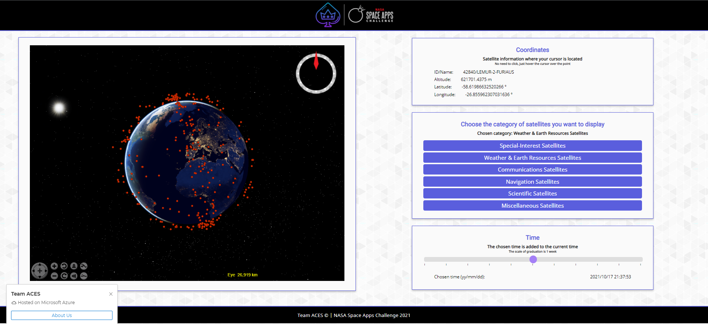

### Hi there 👋

- :trophy: Latest achievement:
  - [NASA Space Apps Challenge](https://www.spaceappschallenge.org/) Winner in France. Project : Eye Above a 3D real time space debris mapper and predictor of satellites trajectories to avoid accidents.
  
   

  - Co-Developed [Blico](https://github.com/nodiz/Blico) for [Lauzhack](https://lauzhack.com/) - Winner of the [SBB challenge](https://devpost.com/software/blinddetector)
  
  [YouTube video](https://www.youtube.com/watch?v=M2HeJXddtcc)
  
  (https://github.com/tripincloud/Lumen)
  
  - [ImagineCup](https://imaginecup.microsoft.com/en-us/Events) Winner in Switzerland, World Cup Semi-finalist.
  
  - Project: Lumen an assistant for the visually impaired.
  
  [Youtube Video](https://www.youtube.com/watch?v=dF65xZh1xRg)
  
  

<!--
**tripincloud/tripincloud** is a ✨ _special_ ✨ repository because its `README.md` (this file) appears on your GitHub profile.
